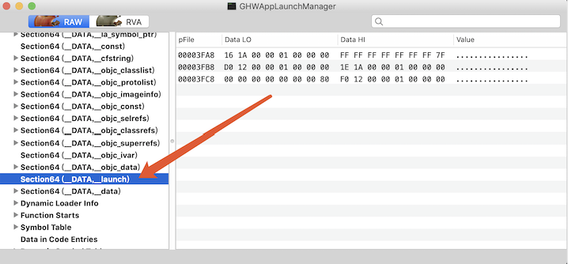

# iOS App 的一种规范启动项执行流程方案

## 前言
随着业务的不断发展，我们的 App 启动要做的事情越来越多，启动时间也随之变长，维护成本越来越高，调试不方便，需要一套更好的方案来管理启动项。我们这里说的启动项是指 App 启动过程中需要被完成的某项工作，比如某个 SDK 的初始化、某个功能的预加载等。

## 现状

### 一. 目前的 App 启动项执行流程
现在我们 App 跟大多数 App 一样，启动的时候都是集中化管理启动项的，如下图，将一堆启动项写在一起，而且分散在很多文件中。 
 


### 二. 存在的问题

#### 1. + (void)load 方法
目前很多模块里面都有使用 load 方法，用于在 main 函数执行前做一些配置，但是 load 方法的使用会带来一些弊端，主要有如下几点  

- 无法 Patch
- 不能审计耗时
- 调用 UIKit 相关方法会导致部分类提早初始化
- main 函数之前执行，而且是主线程完全阻塞式执行，极大增加启动时间

经过排查，发现其实很多 load 函数里面做的事情其实可以延后执行，放到首页渲染完成以后再去做，比如一些路由注册，还有非首页相关业务里面 load 部分代码也可以往后延迟执行。

Xcode 提供了一个方法可以看到 main 之前各个阶段的时间消耗，只需要在 Edit scheme -> Run -> Arguments 中将环境变量 DYLD_PRINT_STATISTICS 设为1。还有一个方法获取更详细的时间，需要将环境变量 DYLD_PRINT_STATISTICS_DETAILS 设为1即可。

我们的 App 启动时间分布如下图，可以看出 load 都1.1秒了。


#### 2. 维护困难

* 所有启动项都要预先写在好几个文件里面，查看整个流程需要在几个文件里面来回切换，这种中心化的写法会导致代码臃肿，难以阅读和维护，新人如果要从头开始了解启动流程，非常费劲。
* 启动流程没有明确定义各个阶段，新的启动项缺乏添加范式，修改风险大，如果要加一个启动项，不同的人为了保险都往前面加，希望保证自己模块能尽早执行，哪些真正需要提前执行的启动项以后也会变成后面执行了。
* 启动项都写在一个文件里面，大家都来修改这个文件，容易出现冲突，误操作，尤其是在大型团队里面。以后启动项不要了还要手动去删除，这个容易遗漏。
* 不能精细化管理，一个模块启动可能有两三个任务，但是只有一个需要在 main 之前执行，其他可以往后放，这种分阶段的初始化不好做。

## 优化方案

### 一. demo

可以先下载 demo 看看，注意 demo 中 Podfile 是使用动态库集成方式哦。
[https://github.com/guohongwei719/GHWAppLaunchManager](https://github.com/guohongwei719/GHWAppLaunchManager)


### 二. 基本思想

我们希望的是启动项维护方式可插拔，启动项、业务模块之间不耦合，我们称之为启动项的自注册：一个启动项定义在子业务模块内部，被封装成一个方法，并且自声明启动阶段，不需要一个中心文件集中设置所有启动项。

### 三. 技术原理

那么如何给一个启动项声明声明启动阶段呢？又如何在正确的时机触发启动项的执行呢？在代码上一个启动项最终都会对应到一个函数的执行，所以在运行时只要能获得函数的指针，就可以出发启动项。优化方案的核心原理就是在编译时把数据（如函数指针）写入到可执行文件的__DATA 段中，运行时再从 __DATA 段取出数据进行相应操作，即调用函数。

程序源代码被编译之后主要分为两个段：程序指令和程序数据。代码段属于程序指令，data 和 .bss 节属于数据段。


Mach-O 的组成结构如上图所示，包含了 Header、Load commands、Data（包含 Segment 的具体数据），我们平时了解到的可执行文件、库文件、Dsym 文件、动态库、动态链接器都是这种格式的。

### 四. 技术实现

#### 1. _____attribute_____

Clang 提供了很多的编译函数，它们可以完成不同的功能，其中一项就是 section() 函数，section() 函数提供了二进制段的读写能力，它可以将一些编译期就可以确定的常量写入数据段。在具体的实现中，主要分为编译期和运行时两部分。在编译期，编译器会将标记了  attribute((section())) 的数据写到指定的数据段中，例如写一个{key(key代表不同的启动阶段), *pointer} 对到数据段。到运行时，在合适的时间节点，在根据 key 读取出函数指针，完成函数的调用。

Clang Attributes 是 Clang 提供的一种源码注解，方便开发者向编译器表达某种要求，参与控制如 Static Analyzer、Name Mangling、Code Generation 等过程，一般以 _____attribute______(xxx) 的形式出现在代码中；为方便使用，一些常用属性也被 Cocoa 定义成宏，比如在系统头文件中经常出现的 NS_CLASS_AVAILABLE_IOS(9_0) 就是 _____attribute_____(availability(...)) 这个属性的简单写法。编译器提供了我们一种 _____attribute_____((section("xxx段，xxx节")的方式让我们将一个指定的数据储存到我们需要的节当中。

**used**

used的作用是告诉编译器，我声明的这个符号是需要保留的。被used修饰以后，意味着即使函数没有被引用，在Release下也不会被优化。如果不加这个修饰，那么Release环境链接器会去掉没有被引用的段。

**section**

通常情况下，编译器会将对象放置于DATA段的data或者bss节中。但是，有时我们需要将数据放置于特殊的节中，此时section可以达到目的。

**constructor**

constructor：顾名思义，加上这个属性的函数会在可执行文件（或 shared library）load时被调用，可以理解为在 main() 函数调用前执行。

constructor 和 +load 都是在 main 函数执行前调用，但 +load 比 constructor 更加早一点，因为 dyld（动态链接器，程序的最初起点）在加载 image（可以理解成 Mach-O 文件）时会先通知 objc runtime 去加载其中所有的类，每加载一个类时，它的 +load 随之调用，全部加载完成后，dyld 才会调用这个 image 中所有的 constructor 方法。所以 constructor 是一个干坏事的绝佳时机：

更多相关知识可以参考 

[http://liumh.com/2018/08/18/ios-attribute-section/](http://liumh.com/2018/08/18/ios-attribute-section/)  
[https://www.jianshu.com/p/965f6f903114](https://www.jianshu.com/p/965f6f903114)  
[https://nshipster.com/__attribute__/](https://nshipster.com/__attribute__/)

#### 2. 编译期写入数据

首先我们定义函数存储的结构体，如下，function 是函数指针，指向我们要写入的函数，key 为附带的信息，后期可以扩展，比如执行优先级，优先级高的函数优先执行。

```
struct GHW_Function {
    char *key;
    void (*function)(void);
};
```
定义函数 GHWStage_A ，里面是需要在 Stage_A 阶段要执行的任务。

```
static void _GHWStage_A () {
    printf("ModuleA:Stage_A");

}
```

将包含函数指针的结构体写入到我们指定的数据区指定的段 __GHW, 指定的节 ___Stage_A，方法如下

```
__attribute__((used, section("__GHW,__Stage_A"))) \
static const struct GHW_Function __FStage_A = (struct GHW_Function){(char *)(&("Stage_A")), (void *)(&_GHWStage_A)}; \
```

上面步骤看起来很烦，而且代码晦涩难懂，所以要使用宏来定义一下，如下

```
#define GHW_FUNCTION_EXPORT(key) \
static void _GHW##key(void); \
__attribute__((used, section("__GHW,__"#key""))) \
static const struct GHW_Function __F##key = (struct GHW_Function){(char *)(&#key), (void *)(&_GHW##key)}; \
static void _GHW##key \
```

然后我们将函数写入数据区方式变得很简单了，还是上面的代码，写入指定的段 __GHW, 指定的节 ___Stage_A，方法如下

```
GHW_FUNCTION_EXPORT(Stage_A)() {
    printf("ModuleA:Stage_A");
}
```
现在可以非常方便简单了。

将工程打包，然后用 MachOView 打开 Mach-O 文件，可以看出数据写入到相关数据区了，如下



#### 3. 运行时读出数据

启动项也需要根据所完成的任务被分类，有些启动项是需要刚启动就执行的操作，如 Crash 监控、统计上报等，否则会导致信息收集的缺失；有些启动项需要在较早的时间节点完成，例如一些提供用户信息的 SDK、定位功能的初始化、网络初始化等；有些启动项则可以被延迟执行，如一些自定义配置，一些业务服务的调用、支付 SDK、地图 SDK 等。我们所做的分阶段启动，首先就是把启动流程合理地划分为若干个启动阶段，然后依据每个启动项所做的事情的优先级把它们分配到相应的启动阶段，优先级高的放在靠前的阶段，优先级低的放在靠后的阶段。

如果要覆盖到 main 之前的阶段，之前我们是使用 load 方法，现在使用 ____attribute____ 的 constructor 属性也可以实现这个效果，而且更方便，优势如下

- 所有 Class 都已经加载完成
- 不用像 load 还得挂在在一个 Class 中

相关代码如下

```
__attribute__((constructor))
void premain() {
    [[GHWExport sharedInstance] executeArrayForKey:@"pre_main"];
}
```

表示在 main 之前去获取数据区 pre_main 节的函数指针执行。  
app willFinish 和 didFinish 阶段也可以执行相关代码，如下

```
- (BOOL)application:(UIApplication *)application willFinishLaunchingWithOptions:(NSDictionary *)launchOptions {
    [[GHWExport sharedInstance] executeArrayForKey:@"Stage_A"];
    return YES;
}

- (BOOL)application:(UIApplication *)application didFinishLaunchingWithOptions:(NSDictionary *)launchOptions {
    [GHWExport.sharedInstance executeArrayForKey:@"Stage_B"];
}
```

#### 4. 读出数据要注意的地方（use_frameworks!）

实际在读的时候要根据我们 podfile 里面集成方式而有所区别，如果 Podfile 里面有 use_frameworks! 则是动态库集成方式，如果注释掉的话就是静态库的集成方式，静态库集成方式比较好办，因为只有一个主二进制文件，写入的数据区也是写到这个里面，只需要从这一个二进制文件里面读取就可以了。代码如下

```
void GHWExecuteFunction(char *key, char *appName) {
    Dl_info info;
    dladdr((const void *)&GHWExecuteFunction, &info);

    const GHWExportValue mach_header = (GHWExportValue)info.dli_fbase;
    const GHWExportSection *section = GHWGetSectByNameFromHeader((void *)mach_header, "__GHW", key);
    if (section == NULL) return;

    int addrOffset = sizeof(struct GHW_Function);
    for (GHWExportValue addr = section->offset;
         addr < section->offset + section->size;
         addr += addrOffset) {

        struct GHW_Function entry = *(struct GHW_Function *)(mach_header + addr);
        entry.function();
    }
}
```

但是如果是动态库集成的各个组件，那么打成包以后各个组件最后跟主二进制文件是分开的，各个组件写入的数据区跟主二进制不是在一起的，而是写入到自己二进制文件里面相应的数据区，因此我们在读的时候需要遍历所有动态库。我们 App 启动时会加载所有动态库，一共有 569个，其中 83 个是 Podfile 里面集成的，其他都是系统库。这些库的路径也有区别，Podfile 集成进去的库路径类似下面这样

```
/private/var/containers/Bundle/Application/70C36D61-CD7A-49F7-A690-0C8B3D36C36A/HelloTrip.app/Frameworks/AFNetworking.framework/AFNetworking
/private/var/containers/Bundle/Application/70C36D61-CD7A-49F7-A690-0C8B3D36C36A/HelloTrip.app/Frameworks/APAddressBook.framework/APAddressBook
/private/var/containers/Bundle/Application/70C36D61-CD7A-49F7-A690-0C8B3D36C36A/HelloTrip.app/Frameworks/AliyunOSSiOS.framework/AliyunOSSiOS
```

系统库类似下面这样

```
/System/Library/Frameworks/AddressBookUI.framework/AddressBookUI
/System/Library/Frameworks/AVFoundation.framework/AVFoundation
/System/Library/Frameworks/AssetsLibrary.framework/AssetsLibrary
/usr/lib/libresolv.9.dylib
```
因此根据路径里面是否包含 /HelloTrip.app/ 来判断是否 Podfile 集成的库，是的话就去找对应的数据区。

经过多次测试，我们 App 在没有过滤路径情况下遍历动态库上的耗时如下  

0.002198934555053711  
0.002250075340270996  
0.003002047538757324  
0.006783008575439453  
0.002267003059387207  
0.003368020057678223  
0.003902077674865723  

有过滤路径情况下遍历时间如下：

0.0004119873046875  
0.0007159709930419922  
0.0004429817199707031  
0.0004270076751708984  
0.0004940032958984375  
0.0004789829254150391  
0.0004340410232543945  
0.0004389286041259766  

可见过滤情况下遍历一次所有动态库不到一毫秒，完全可以接受。因此如果 Podfile 中开启了 use_frameworks! ，使用动态库集成方式，那么读取 section 数据具体代码如下

```
void GHWExecuteFunction(char *key, char *appName) {
    int num = _dyld_image_count();
    for (int i = 0; i < num; i++) {
        const char *name = _dyld_get_image_name(i);
        if (strstr(name, appName) == NULL) {
            continue;
        }
        const struct mach_header *header = _dyld_get_image_header(i);
//        printf("%d name: %s\n", i, name);

        Dl_info info;
        dladdr(header, &info);

        const GHWExportValue dliFbase = (GHWExportValue)info.dli_fbase;
        const GHWExportSection *section = GHWGetSectByNameFromHeader(header, "__GHW", key);
        if (section == NULL) continue;
        int addrOffset = sizeof(struct GHW_Function);
        for (GHWExportValue addr = section->offset;
             addr < section->offset + section->size;
             addr += addrOffset) {

            struct GHW_Function entry = *(struct GHW_Function *)(dliFbase + addr);
            entry.function();
        }
    }
}
```

### 五. 总结

在启动流程中，在启动阶段 Stage_A 触发所有注册到 Stage_A 时间节点的启动项，通过对这种方式，几乎没有任何额外的辅助代码，我们用一种很简洁的方式完成了启动项的自注册。如果要查看 Stage_A 阶段的启动项，直接在项目里面搜索即可，方便快捷，不会遗漏。

后续需要确定启动项的添加 & 维护规范，启动项分类原则，优先级和启动阶段，目的是管控性能问题增量，保证优化成果。

## 后记

欢迎提一起探讨技术问题，觉得可以给我点个 star，谢谢。  
微博：[黑化肥发灰11](https://weibo.com/u/2977255324)   
简书地址：[https://www.jianshu.com/u/fb5591dbd1bf](https://www.jianshu.com/u/fb5591dbd1bf)  
掘金地址：[https://juejin.im/user/595b50896fb9a06ba82d14d4](https://juejin.im/user/595b50896fb9a06ba82d14d4)


