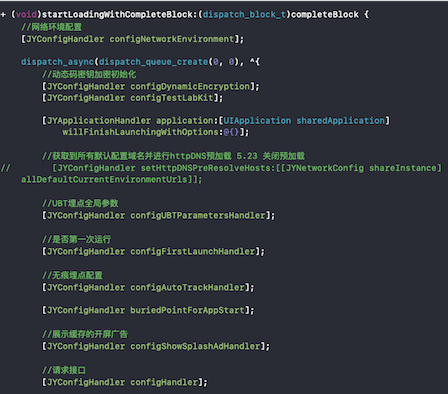
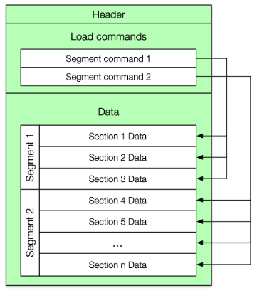

# iOS App 的一种规范启动项执行流程方案

## 前言
随着业务的不断发展，我们的 App 启动要做的事情越来越多，启动时间也随之变长，维护成本越来越高，调试不方便，需要一套更好的方案来管理启动项。我们这里说的启动项是指 App 启动过程中需要被完成的某项工作，比如某个 SDK 的初始化、某个功能的预加载等。

## 现状

### 一. 目前的 App 启动项执行流程
现在我们 App 跟大多数 App 一样，启动的时候都是集中化管理启动项的，如下图，将一堆启动项写在一起，而且分散在很多文件中。 
 

### 二. 存在的问题

#### 1. + (void)load 方法
目前很多模块里面都有使用 load 方法，用于在 main 函数执行前做一些配置，但是 load 方法的使用会带来一些弊端，主要有如下几点  

- 无法 Patch
- 不能审计耗时
- 调用 UIKit 相关方法会导致部分类提早初始化
- main 函数之前执行，而且是主线程完全阻塞式执行，极大增加启动时间

经过排查，发现其实很多 load 函数里面做的事情其实可以延后执行，放到首页渲染完成以后再去做，比如一些路由注册，还有非首页相关业务里面 load 部分代码也可以往后延迟执行。

Xcode 提供了一个方法可以看到 main 之前各个阶段的时间消耗，只需要在 Edit scheme -> Run -> Arguments 中将环境变量 DYLD_PRINT_STATISTICS 设为1。还有一个方法获取更详细的时间，需要将环境变量 DYLD_PRINT_STATISTICS_DETAILS 设为1即可。

我们的 App 启动时间分布如下图，可以看出 load 都1.1秒了。

#### 2. 维护困难

* 所有启动项都要预先写在好几个文件里面，查看整个流程需要在几个文件里面来回切换，这种中心化的写法会导致代码臃肿，难以阅读和维护，新人如果要从头开始了解启动流程，非常费劲。
* 启动流程没有明确定义各个阶段，新的启动项缺乏添加范式，修改风险大，如果要加一个启动项，不同的人为了保险都往前面加，希望保证自己模块能尽早执行，哪些真正需要提前执行的启动项以后也会变成后面执行了。
* 启动项都写在一个文件里面，大家都来修改这个文件，容易出现冲突，误操作，尤其是在大型团队里面。以后启动项不要了还要手动去删除，这个容易遗漏。
* 不能精细化管理，一个模块启动可能有两三个任务，但是只有一个需要在 main 之前执行，其他可以往后放，这种分阶段的初始化不好做。

## 优化方案

### 一. demo

可以先下载 demo 看看，注意 demo 中 Podfile 是使用动态库集成方式哦。
[https://github.com/guohongwei719/GHWAppLaunchManager](https://github.com/guohongwei719/GHWAppLaunchManager)

### 二. 基本思想

我们希望的是启动项维护方式可插拔，启动项、业务模块之间不耦合，我们称之为启动项的自注册：一个启动项定义在子业务模块内部，被封装成一个方法，并且自声明启动阶段，不需要一个中心文件集中设置所有启动项。

### 三. 技术原理

那么如何给一个启动项声明声明启动阶段呢？又如何在正确的时机触发启动项的执行呢？在代码上一个启动项最终都会对应到一个函数的执行，所以在运行时只要能获得函数的指针，就可以出发启动项。优化方案的核心原理就是在编译时把数据（如函数指针）写入到可执行文件的__DATA 段中，运行时再从 __DATA 段取出数据进行相应操作，即调用函数。

程序源代码被编译之后主要分为两个段：程序指令和程序数据。代码段属于程序指令，data 和 .bss 节属于数据段。

Mach-O 的组成结构如上图所示，包含了 Header、Load commands、Data（包含 Segment 的具体数据），我们平时了解到的可执行文件、库文件、Dsym 文件、动态库、动态链接器都是这种格式的。

### 四. 技术实现

#### 1. _____attribute_____

Clang 提供了很多的编译函数，它们可以完成不同的功能，其中一项就是 section() 函数，section() 函数提供了二进制段的读写能力，它可以将一些编译期就可以确定的常量写入数据段。在具体的实现中，主要分为编译期和运行时两部分。在编译期，编译器会将标记了  attribute((section())) 的数据写到指定的数据段中，例如写一个{key(key代表不同的启动阶段), *pointer} 对到数据段。到运行时，在合适的时间节点，在根据 key 读取出函数指针，完成函数的调用。

Clang Attributes 是 Clang 提供的一种源码注解，方便开发者向编译器表达某种要求，参与控制如 Static Analyzer、Name Mangling、Code Generation 等过程，一般以 _____attribute______(xxx) 的形式出现在代码中；为方便使用，一些常用属性也被 Cocoa 定义成宏，比如在系统头文件中经常出现的 NS_CLASS_AVAILABLE_IOS(9_0) 就是 _____attribute_____(availability(...)) 这个属性的简单写法。编译器提供了我们一种 _____attribute_____((section("xxx段，xxx节")的方式让我们将一个指定的数据储存到我们需要的节当中。

**used**

used的作用是告诉编译器，我声明的这个符号是需要保留的。被used修饰以后，意味着即使函数没有被引用，在Release下也不会被优化。如果不加这个修饰，那么Release环境链接器会去掉没有被引用的段。

**section**

通常情况下，编译器会将对象放置于DATA段的data或者bss节中。但是，有时我们需要将数据放置于特殊的节中，此时section可以达到目的。

**constructor**

constructor：顾名思义，加上这个属性的函数会在可执行文件（或 shared library）load时被调用，可以理解为在 main() 函数调用前执行。

constructor 和 +load 都是在 main 函数执行前调用，但 +load 比 constructor 更加早一点，因为 dyld（动态链接器，程序的最初起点）在加载 image（可以理解成 Mach-O 文件）时会先通知 objc runtime 去加载其中所有的类，每加载一个类时，它的 +load 随之调用，全部加载完成后，dyld 才会调用这个 image 中所有的 constructor 方法。所以 constructor 是一个干坏事的绝佳时机：

更多相关知识可以参考 

[http://liumh.com/2018/08/18/ios-attribute-section/](http://liumh.com/2018/08/18/ios-attribute-section/)  
[https://www.jianshu.com/p/965f6f903114](https://www.jianshu.com/p/965f6f903114)  
[https://nshipster.com/__attribute__/](https://nshipster.com/__attribute__/)

#### 2. 编译期写入数据

