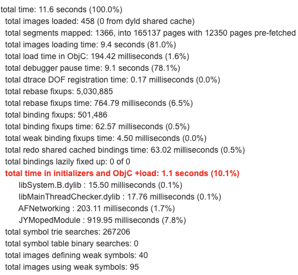

# iOS App 的一种规范启动项执行流程方案

## 前言
随着业务的不断发展，我们的 App 启动要做的事情越来越多，启动时间也随之变长，维护成本越来越高，调试不方便，需要一套更好的方案来管理启动项。我们这里说的启动项是指 App 启动过程中需要被完成的某项工作，比如某个 SDK 的初始化、某个功能的预加载等。

## 现状

### 一. 目前的 App 启动项执行流程
现在我们 App 跟大多数 App 一样，启动的时候都是集中化管理启动项的，如下图，将一堆启动项写在一起，而且分散在很多文件中。

### 二. 存在的问题

#### 1. + (void)load 方法
目前很多模块里面都有使用 load 方法，用于在 main 函数执行前做一些配置，但是 load 方法的使用会带来一些弊端，主要有如下几点  

- 无法 Patch
- 不能审计耗时
- 调用 UIKit 相关方法会导致部分类提早初始化
- main 函数之前执行，而且是主线程完全阻塞式执行，极大增加启动时间

经过排查，发现其实很多 load 函数里面做的事情其实可以延后执行，放到首页渲染完成以后再去做，比如一些路由注册，还有非首页相关业务里面 load 部分代码也可以往后延迟执行。

Xcode 提供了一个方法可以看到 main 之前各个阶段的时间消耗，只需要在 Edit scheme -> Run -> Arguments 中将环境变量 DYLD_PRINT_STATISTICS 设为1。还有一个方法获取更详细的时间，需要将环境变量 DYLD_PRINT_STATISTICS_DETAILS 设为1即可。

我们的 App 启动时间分布如下图，可以看出 load 都1.1秒了。

#### 2. 维护困难

* 所有启动项都要预先写在好几个文件里面，查看整个流程需要在几个文件里面来回切换，这种中心化的写法会导致代码臃肿，难以阅读和维护，新人如果要从头开始了解启动流程，非常费劲。
* 启动流程没有明确定义各个阶段，新的启动项缺乏添加范式，修改风险大，如果要加一个启动项，不同的人为了保险都往前面加，希望保证自己模块能尽早执行，哪些真正需要提前执行的启动项以后也会变成后面执行了。
* 启动项都写在一个文件里面，大家都来修改这个文件，容易出现冲突，误操作，尤其是在大型团队里面。以后启动项不要了还要手动去删除，这个容易遗漏。
* 不能精细化管理，一个模块启动可能有两三个任务，但是只有一个需要在 main 之前执行，其他可以往后放，这种分阶段的初始化不好做。

## 优化方案

